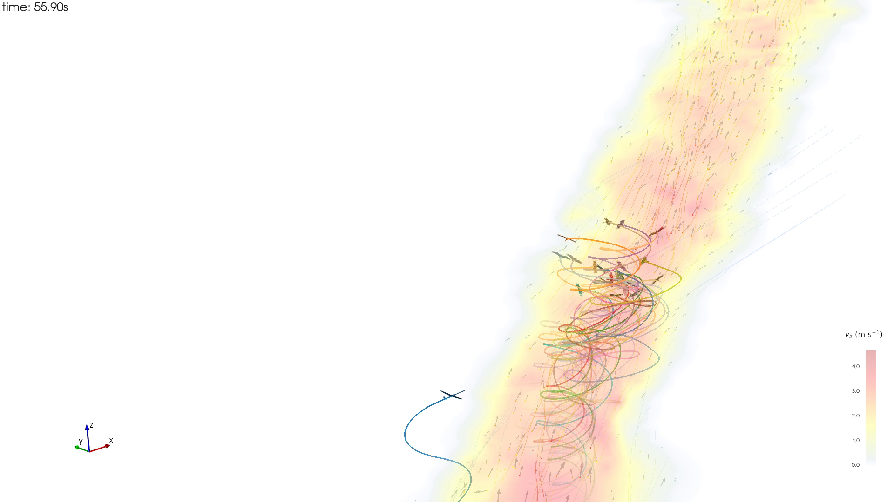

# Flight Behavior Analysis of a Simulated Glider and Storks in Reconstructed Thermal Updrafts
## Introduction

The atmosphere contains kinetic and potential energy that can manifest as structured vertical air motions such as thermal updrafts. Thermals arise from buoyancy-driven convection caused by uneven surface heating. Birds harness these thermals during migration or while searching for prey to minimize energy expenditure.
## Project

Based on GPS recordings of thermalling storks during migration (1), thermal updrafts are reconstructed in simulation (2), where AI agent flies together with the birds. The storks' positions serve as a source of social information that the AI agent can use to locate and exploit the thermal. The dataset contains recordings of these simulations.

The goal of the project to extract as much meaningful information and behavioral insight as possible from the resulting dataset.

*Figure 1: 3D animation of an episode of the simulation: The AI agent (blue) approaches the thermal where storks thermalling in a group (based on recorded GPS coordinates). The color coding of the thermal represents the vertical air velocity field.*
## Dataset
The dataset consists recordings of simulation in multiple thermals, with multiple episodes per thermal. Each episode includes:
- Position and orientation (in inertial frame), and linear velocity for both the AI agent and the birds.
- Atmospheric Data: The velocity of the surrounding air velocity field at the coordinates of the birds / agent.
- Additional instantaneous data
- Other metadata (e.g. bird's name, wing loading)

## Steps

### 1. Understand the data

Understand the different dimensions:
      * Thermal: The specific reconstructed updraft instance
      * Episode: Individual simulation rollout with distinct random initial conditions
      * Agent: The specific bird GPS recording or AI agent
      * Time: Discrete simulation time with fixed time step size
      * The initial distance of the AI agent from the thermal core
### 2. Load the dataset

Recommended library: **Xarray** for handle labelled multi-dimensional data: https://docs.xarray.dev/en/stable/getting-started-guide/why-xarray.html (but any alternative is acceptable)

Plot flight trajectories, encoding vertical velocity data through color coding.
### 3. Feature engineering (metrics, trends, phases)

Compute several **metrics** from the raw time-series data (use windowing or smoothing to reduce noise):
- Examples:
	- curvature
	- angular velocity
	- climb rate (e.g. for last 10 seconds, last 30 seconds)
Identify **trends** based on the metrics:
- Examples:
	- Climbing / descending
	- Tightening or widening circles
	- Consistent left or right circling
Detect **phase** changes:
- Examples:
	- Gliding (low curvature, sinking)
	- Searching (shallow turns, variable heading)
	- Thermalling (circular motion with sustained positive climb)

### 3. Extract insights from the data

- General (birds / AI agents)
	- What is the typical radius of circling?
	- How much does the circling direction change?
	- Average climb rates while thermalling?
	- How close do they fly to the thermal core?
- AI agent specific:
	- Time until first thermal capture
	- Longest continuous thermalling segment
	- Number of thermal losses and re-acquisitions
	- How well agent estimates core position when circling

Additional metrics and analyses are encouraged.
## Literature

1. Flack, A.; Nagy, M.; Fiedler, W.; Couzin, I. D.; Wikelski, M. From Local Collective Behavior to Global Migratory Patterns in White Storks. _Science_ **2018**, _360_ (6391), 911–914. [https://doi.org/10.1126/science.aap7781](https://doi.org/10.1126/science.aap7781).
2. Lacerda, P.; Szarvas, Z.; Zábó, A.; Li, L.; Vicsek, T.; Istenes, Z.; Nagy, M. Soaring, Aerodynamics and Complex Flows in Thermals. Manuscript in preparation, 2026.
